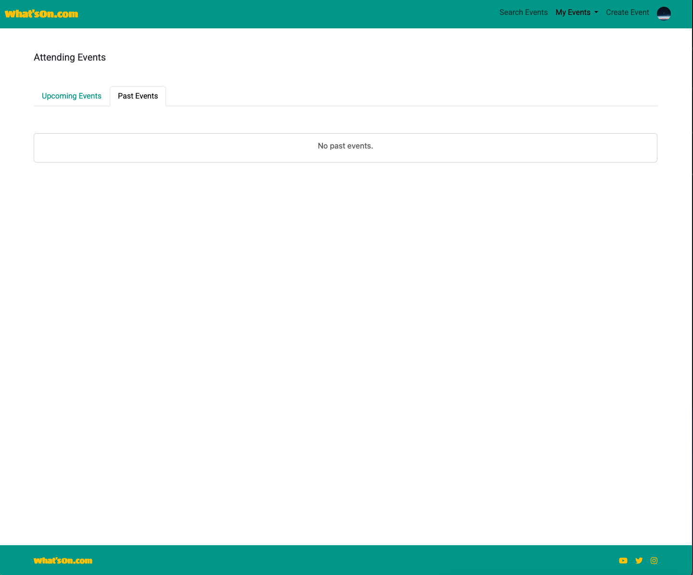

# What'sOn.com Feature List

## Web Pages
- Home page
- Login page
- Logout page
- Register page
- Create Event page
- Attending Event page
- Event detail page
- Edit Event page
- Hosting Event page
- Search Events page
- User Profile page

### Access to pages based on user authentication

| Page Name     |  Is Authenticated    | Is Not Authenticated |
| ------------- | ------------- | ------------- |
| Home page                 | Y | Y |
| Login page                | N | Y |
| Logout page               | Y | N |
| Register page             | N | Y |
| Create Event page         | Y | N |
| Attending Event page      | Y | N |
| Event detail page         | Y | N |
| Edit Event page           | Y | N |
| Hosting Event page        | Y | N |
| Search Events page        | Y | N |
| User Profile page         | Y | N |

- If the user is authenticated and tries to access either login or register page it will redirect them to the search page as the logged in user. 
- each page has a navbar and a footer which is extended from the [base.html](/templates/base.html) file.

### navbar
The navbar has the following links:
- Login 
- Register
- Search Events
- My Events
    - Hosting
    - Attending
- Create Event
- My Profile
- Sign Out
- Site Logo (Which directs them to the home page)

When a user is logged out the navbar looks like this:

When a user is logged in the navbar looks like this:

The Site Logo links to a different "home" page depending if the user is logged in or not.

- When user is loged in. The link directs them to the [Search Events](/event/templates/event/event_search.html) page.
- When the user is logged out. The link directs them to the [Home](/templates/home.html) page.

### footer
The footer contains a link to the homepage and links to social media accounts for the site. Currently the links redirect in a blank page to the sites themselves as this site does not have any social media presence.

The link to the homepage functions like the navbar. When user is loged in. The link directs them to the [Search Events](/event/templates/event/event_search.html) page. When the user is logged out. The link directs them to the [Home](/templates/home.html) page.

### home page
The home page is the first page that a user sees on the site (If they are not already a user and logged in). It contains information about what to expect when using the site. Different sections explaining the types of events, where they can find events and why use the site for their event needs. 

### registration page
The registration page is a straight forward sign up page. It utilises the AllAuth package to handle the creation of the user and serve the fields needed to register. The Password field contains helpful prompts about creating a password.

If the user already has a profile then there is a link to the sign in page.

### login page
The login page again is a simple login form. It requests the users Email and Password to authenticate them. The authenication is handled by AllAuth. 

If the user does not have a profile then there is a link to the register page.

There is a check box "Remember Me" which can help control the time of the users session. The value is defaulted to "None".

### logout page
The logout page askes for confirmation from the user before logging them out. 

### create event page
The event create page allows a user to create their own custom events. The fields displayed are directly related to the model. Not all fields are required by the model but the form has them all set bar the Limit field to be required. This allows better events to be created by the user without having missing details. See more on the validation of event data below.

### attending event page
This pages shows the user what events they are attending and displays them neatly in a row of 3 columns. Allowing them to get a snapshot of the events in one place. The upcoming events are also paginated to allow less clutter on the screen. The page is split into tabbed content. The "Upcoming Events" tab displays any event greater than the current day. The "Past Events" tab shows all events that have already happened. If a user is not attending any upcoming events instead of showing them a blank screen there is a helpful message with a link to search for events.

### hosting event page
The hosting event page functions the same as the attending page. Its split into "Upcoming Events" which are events that have not happened yet and "Past Events" which are events that have already happened. Similarly, if a user is not hosting any events we display a helpful message directing the user to the create an event page. 

### event detail page
The event detail page gives an overview of the event details. Information such as the description, the host, the date, start time and end time, the location, the category and how many are attending. 

Depending on some conditions the event detail will display extra information. If the host has set a limit of attending then this limit will be displayed.

If the number of attendees is the same as the event limit set then a non host user will not be able to attend. The button to attend will not be present.

If the event is in the past then the host will only be able to delete it and not edit it further. 

If the event is in the past and the user is not the host then they will the following message.

The host can also have the ability to delete the event. There is a confirmation modal that pop ups to confirm if they want to delete it. 

### edit event page
The event edit page uses an instance of the event to populate the form. It re-uses the same form as create event and thus employs the same validation. See more below on event validation.

### search events page
The search events page is a pagination page which displays 10 events per page. It only shows events that have not happened yet e.g event date is in the future.

### user profile page
The user profile page is a form populated with the instance of the current user. It doesnt display all the user fields but only the fields necessary to use the site. There is also some form validation happening so as not to mess up any existing data. For vlaidation please see below. 

### file upload and user profile
In all of the forms there is a field to upload an image. A user can add an image to their Event in both the create and edit events forms. A user can also upload a profile picture to their profile. When a user uploads a profile picture it refreshes the page and the new updated profile picture will appear in the navbar to the right. 

## Validation

## User

### Update email
If a user tries to update their email address but there is already a user with the same email then the form will raise a validation error letting the user know. 

### Update phone number
The phone number field only accepts a valid Irish phone number. If the user enters anything but an irish phone number it will raise a validation error. 

### user profile required fields
While not all fields are required for the user model the form emplores some validation on the front end. The first name, last name, email and about fields are all required when updating a profile. 

## Event

### create event required fields
Not all fields are required by the Event model but the form has them all set bar the Limit field to be required. Similar to the User Profile form the Event form has front end validation to ensure events created have enough detail in them.

### event date
The event date cannot be in the past. If a user sets a date that is in the past then the form will raise a validation error. 

### event start time
If the start time of an event has past then the start time field will raise a validation error. The Date field is uded to determine if the start time is in the past or not. 

### event end time
The event end time cannot be less than the event start time or the same as the event start time. If this is the case then a validation error is thrown on the field. 

### event limit
If the number of attendees to an event is the same as the event limit then the "Attend" button is not shown on the webpage. 

