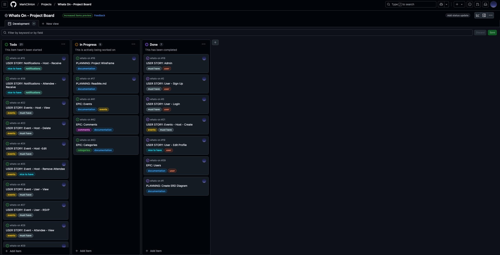
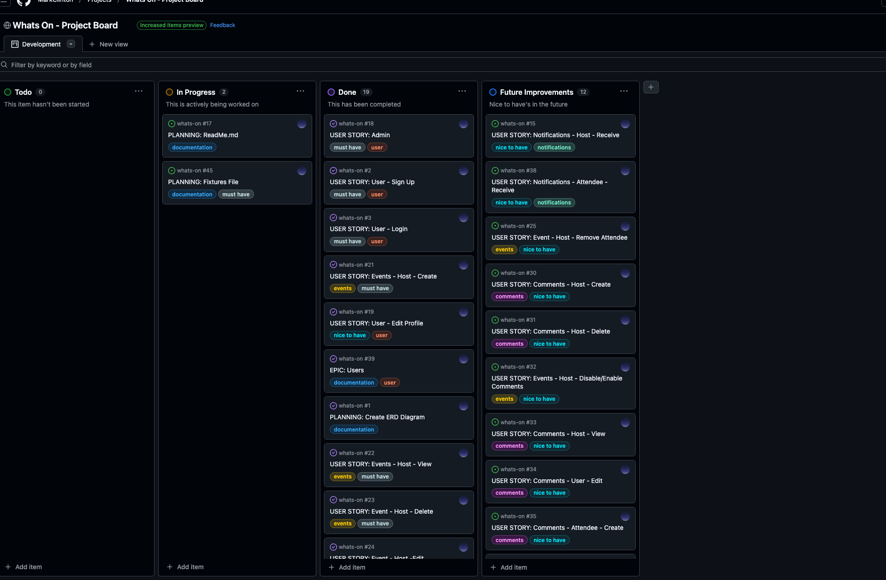
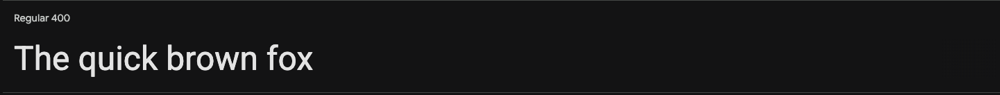
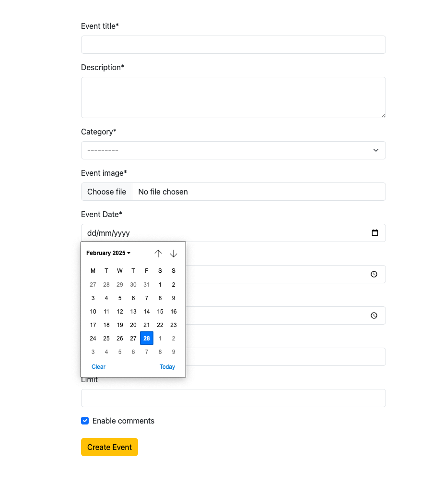
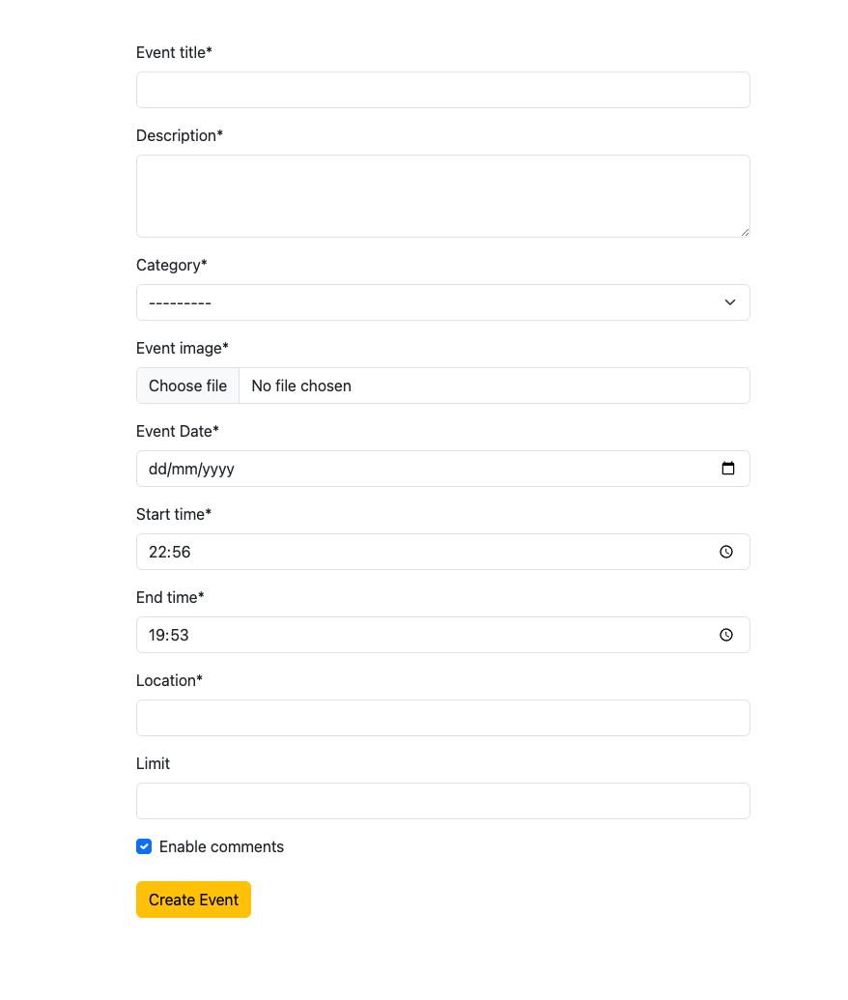
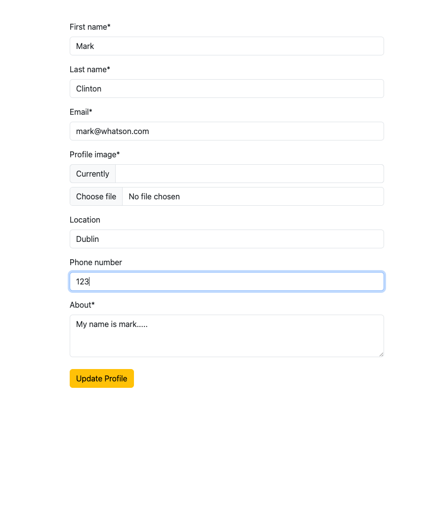
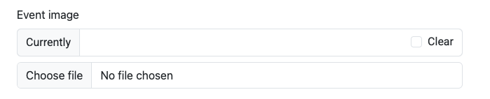
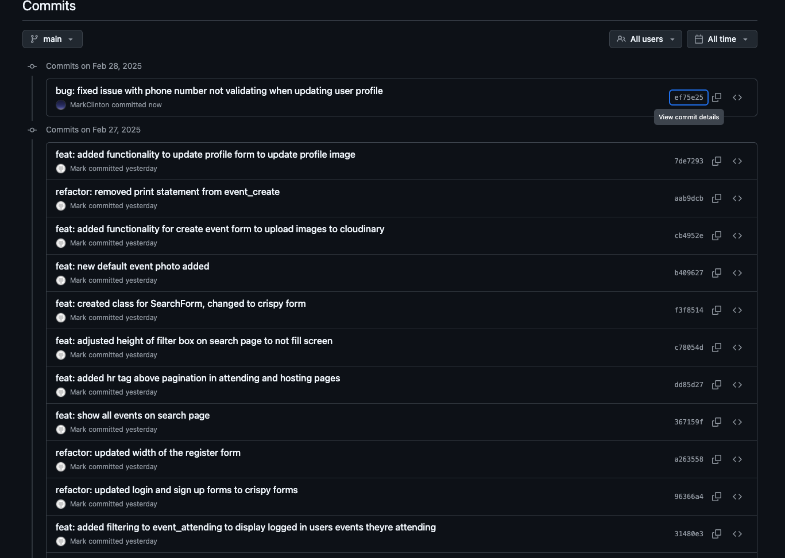

# What'sOn.com

Live Site: [What'sOn.com](https://whats-on-2ddb76c9efe6.herokuapp.com/)

Repository: [GitHub Repository](https://github.com/MarkClinton/whats-on)


## About
[What'sOn.com](https://whats-on-2ddb76c9efe6.herokuapp.com/) is a social events app which lets users create their own events and search for events theyre interested in. Users can express interest by attending events which they can keep track of in their My Events section. They can also create events which can be maintained in the My Events section. 

## User Stories & Epics

#### **Events**
[Events Epic](https://github.com/MarkClinton/whats-on/issues/41)

| Issue ID    | User Story |
|-------------|-------------|
|[#29](https://github.com/MarkClinton/whats-on/issues/29)| As a attendee I can remove my attending status to an event so that I am no longer attending |
|[#28](https://github.com/MarkClinton/whats-on/issues/28)| As a attendee of an event I can view the event page so that see whats going on |
|[#27](https://github.com/MarkClinton/whats-on/issues/27)| As a user I can attend an event so that I can book my spot at the event.|
|[#26](https://github.com/MarkClinton/whats-on/issues/26)| As a user I can view the details of an event so that I can decide whether or not to attend.|
|[#24](https://github.com/MarkClinton/whats-on/issues/24)| As a event host I can edit the details of an event so that the event details are kept up to date.|
|[#23](https://github.com/MarkClinton/whats-on/issues/23)| As a host of an event I can delete an event so that the event no longer exists.|
|[#22](https://github.com/MarkClinton/whats-on/issues/22)| As a host of an event I can view my hosted events so that I can check all details.|
|[#21](https://github.com/MarkClinton/whats-on/issues/21)| As a user I can create an event so that I can allow others to attend.|
|[#25](https://github.com/MarkClinton/whats-on/issues/25)| As a host of an event I can remove an attendeeso that they no longer can go to the event.|
|[#32](https://github.com/MarkClinton/whats-on/issues/32)| As a host of an event I can disable and enable comments on my event so that attendees can or cannot comment.|

#### **User**
[User Epic](https://github.com/MarkClinton/whats-on/issues/39)

| Issue ID    | User Story |
|-------------|-------------|
|[#18](https://github.com/MarkClinton/whats-on/issues/18)| As a Site Manager/Admin I can access the admin panel so that I have a full overview of the models and their content |
|[#2](https://github.com/MarkClinton/whats-on/issues/2)| As a new user of Whats On I can sign up with my email to create an account So that I can search for events and use the full benefits of the site |
|[#3](https://github.com/MarkClinton/whats-on/issues/3)| As an existing user I can use my email to sign in so that I can access my account.|
|[#19](https://github.com/MarkClinton/whats-on/issues/19)| As a user I can edit my user profile so that my information is updated.|

#### **Categories**
[Categories Epic](https://github.com/MarkClinton/whats-on/issues/43)

| Issue ID    | User Story |
|-------------|-------------|
|[#44](https://github.com/MarkClinton/whats-on/issues/44)| As a Host I can add or edit the category for my event so that the correct category to my event |

Project Board during development


Finished Project Board after development


## Technologies used

- ### Languages:
    
    + [Python 3.10.4](https://www.python.org/downloads/release/python-3104/): the primary language used to develop the server-side of the website.
    + [JS](https://www.javascript.com/): language used to develop some interactive components of the website.
    + [HTML](https://developer.mozilla.org/en-US/docs/Web/HTML): the markup language used to create the website.
    + [CSS](https://developer.mozilla.org/en-US/docs/Web/css): the styling language used to style the website.

- ### Frameworks and libraries:

    + [Django](https://www.djangoproject.com/): python framework used to create all the logic.
    + [Bootstrap 5.3](https://getbootstrap.com/docs/5.3/getting-started/introduction/): CSS framework used to design the site with builtin JS. 

- ### Databases:

    + [PostgreSQL](https://www.postgresql.org/): the database used to store all the data.

- ### Other tools:

    + [Git](https://git-scm.com/): the version control system used to manage the code.
    + [Pip3](https://pypi.org/project/pip/): the package manager used to install the dependencies.
    + [Venv](https://docs.python.org/3/library/venv.html): virtual environment used for the project.
    + [Gunicorn](https://gunicorn.org/): the webserver used to run the website.
    + [Spycopg2](https://www.python.org/dev/peps/pep-0249/): the database driver used to connect to the database.
    + [Django-allauth](https://django-allauth.readthedocs.io/en/latest/): the authentication library used to create the user accounts.
    + [Django-crispy-forms](https://django-cryptography.readthedocs.io/en/latest/): was used to control the rendering behavior of Django forms.
    + [Django Phone Number Field](https://django-phonenumber-field.readthedocs.io/en/latest/): was used for the phone number field on teh User model.
    + [Heroku](https://www.heroku.com/): the cloud platform used to host the website.
    + [PostgreSQL from Code Institute](https://dbs.ci-dbs.net/): PostgreSQL database used to store all the dat provided by Code Institute.
    + [GitHub](https://github.com/): used to host the website's source code.
    + [VSCode](https://code.visualstudio.com/): the IDE used to develop the website.
    + [Chrome DevTools](https://developer.chrome.com/docs/devtools/open/): was used to debug the website.
    + [Font Awesome](https://fontawesome.com/): was used to create the icons used in the website.
    + [Miro](https://miro.com/app/dashboard/) was used to make a flowchart for the README file.
    + [Balsamiq](https://balsamiq.com/) was used to make a wireframe mockups of the site.
    + [W3C Validator](https://validator.w3.org/): was used to validate HTML5 code for the website.
    + [W3C CSS validator](https://jigsaw.w3.org/css-validator/): was used to validate CSS code for the website.
    + [JShint](https://jshint.com/): was used to validate JS code for the website.
    + [PEP8](https://pep8.org/): was used to validate Python code for the website.

## Features
Please see [FEATURES.md](FEATURES.MD) document for an overview of all features.

## Design 

The overall design was intended to convey social interactions. Bright colours easy to navigate. The design of the application is based on the Material Design principles. The central theme of the application is the simplicity of use. The decision to implement white spaces was made as it helps to create a more pleasant user experience.

### Colour Scheme
I wanted a consistent colour scheme through the website. It needed to be clean and not overpowering. I settled on the main colour of #009688 which is a deep green. The secondary colour was chosen to contrast the deep green. I settled on a yellow #ffc107. Both compliment each other and work well not to give the site an overall feeling of fun. 


### Typography
The main typography used throughoput the site is Roboto. This font is consistent and sleek in design and its readability. Sigmar is used a the brands font. Its playful compared to Roboto and contrasts nicely.

Roboto

Sigmar


### Imagery
The images used throughout the site all came from [Unsplash](https://unsplash.com/s/photos/event)

### Wireframe
The wireframe was created with [Balsamiq](https://balsamiq.com/). The actual site varies in style compared to the wireframe. The wireframe contains mockups of functionality that I didnt have time to complete. The layout follows the same design. 
- [WhatsOn Wireframe](documentation/wireframe/WhatsOn_Wireframe.pdf)

## Information Architecture

### Database
- From the beginning the database was created using PostgresSQL. To ensure no issue.

### Entity- Relationship Diagram
- The ERD was created using [Miro](https://miro.com/app/dashboard/)
- [Database Schema](/documentation/erd/ERD_Diagram.png)

### Data Modeling

#### NewUser
This is a custom user model which extends Django's AbstractBaseUser.

| Name          | Database Key  | Field Type    | Validation |
| ------------- | ------------- | ------------- | ---------- |
| Email          | email          | EmailField         |  unique=True    |
| First Name     | first_name     | CharField          | max_length=150  |
| Last Name      | last_name      | CharField          | max_length=150  |
| Profile Image  | profile_image  | CloudinaryField    | default='profile_image     |
| About          | about          | TextField          | max_length=500, blank=True |
| Location       | location       | CharField          | max_length=100, blank=True |
| Created At     | created_at     | DateTimeField      | auto_now=True  |
| Phone Number   | phone_number   | PhoneNumberField   | blank=True     |
| Is Active      | is_active      | BooleanField       | default=True   |
| Is Staff       | is_staff       | BooleanField       | default=False  |

#### Category
Category is a seperate model which holds values for each category. The reason is to have an easily updateable table for categories that can serve the Event.

| Name          | Database Key  | Field Type    | Validation |
| ------------- | ------------- | ------------- | ---------- |
| Name          | name          | CharField         | max_length=50    |
| Created At    | created_at    | DateTimeField     | auto_now_add=True   |

#### Event
The main event model which holds the data for events and the relationships.
There is 2 relationships in this data model. 
- Category - One Category can have many events. 
- User - One host can have many events. 
Both work off a ManyToOne relationship.

| Name          | Database Key  | Field Type    | Validation |
| ------------- | ------------- | ------------- | ---------- |
| Event Title       | event_title       | CharField          | max_length=200 |
| Description       | description       | TextField          | -- |
| Category          | category          | ManyToOne          | Category, related_name="events  |
| Host              | host              | ManyToOne          | User, related_name="event  |
| Event Image       | event_image       | CloudinaryField    | default='event_image  |
| Date              | date              | DateField          | -- |
| Start Time        | start_time        | TimeField          | -- |
| End Time          | end_time          | TimeField          | -- |
| Location          | location          | CharField          | max_length=50   |
| Enable Comments   | enable_comments   | BooleanField       | default=True    |
| Limit             | limit             | IntegerField       | blank=True, null=True  |
| Is Deleted        | is_deleted        | BooleanField       | default=False  |
| Created At        | created_at        | DateTimeField      | auto_now_add=True  |
| Last Updated      | last_updated      | DateTimeField      | auto_now=True  |

#### EventAttendees
This table is used to store the information about each users attended events.
There is 2 relationships in this data model: 
- Event - Each Attendee belongs to one event.
- User - Each attendee belongs to one user
Both work off a ManyToOne relationship.

| Name          | Database Key  | Field Type    | Validation |
| ------------- | ------------- | ------------- | ---------- |
| Event          | event        | ManyToOne           | Event, related_name="attending" |
| Attendee       | attendee     | ManyToOne           | User, related_name="attendee" |
| RSVP           | rsvp         | IntegerField        | choices=RESPONSE, default=0  |
| Is Blocked     | is_blocked   | BooleanField        | default=False  |
| Created At     | created_at   | DateTimeField       | auto_now_add=True  |

```Python
    # RSVP Choices
    RESPONSE = (
        (0, "Not Going"), 
        (1, "Going"), 
        (2, "Maybe")
    )
```

### Future Functionality
You may notice that some of these models have fields that are not used throughout the application. Such as is_deleted and enable_comments in the Event data model. Or, is_blocked and rsvp in the EventAttendees data model. These data models were designed at the start of development but due to time constraints could not be implemented properly, thus they never made it to the final release. 

In the ERD Diagram you will notice 2 extra models, Notifications and Comments. These were planned data models for the application but could not be implemented in time. More details about how these data models should work can be found on the project board.

- [Notifications Epic](https://github.com/MarkClinton/whats-on/issues/40)
- [Comments Epic](https://github.com/MarkClinton/whats-on/issues/42)

## Testing

## Deployment
To deploy this project either locally or to Heroku, please follow the below steps:

#### Fork the repository

By forking the GitHub Repository you can make a copy of the original repository to view or change without it effecting the original repository. The forked repository will be easier to find when we deploy to Heroku.

+ Log in to [GitHub](https://github.com/) or create an account
+ Navigate to this [respository](https://github.com/MarkClinton/whats-on) 
+ Select "Fork" at the top of the screen
+ A copy of the repository should now be created in your own repository

### Heroku Deployment

#### Heroku setup
+ Sign up or Login to [Heroku](https://www.heroku.com/)
+ On the Heroku Dashboard click 'New' on the top right and select 'Create new app'
+ Give the app a unique name and select the location most appropiate to you
+ Click 'Create app'
+ Navigate to the 'Deploy' tab and select GitHub as the 'Deployment method'
+ Search and connect to the respository you just forked from the [Fork the repository](#fork-the-repository) steps above.
+ Next, navigate to the 'Settings' tab and scroll down to the 'Config Vars' section
+ Click 'Reveal Config Vars'
+ Here we need to add the 3 environment variables to Heroku

| Key    | Value |
|-------------|-------------|
| CLOUDINARY_URL | Your Cloudinary API environment variable |
| DATABASE_URL   | Your PostgreSQL Database URL |
| SECRET_KEY     | Your Secret Key Value |

#### Heroku deployment
+ Navigate back to the 'Deploy' tab.
+ Ensure that the correct GitHub repository is still connected.
+ Click 'Deploy Branch' in the 'Manual deploy' section.
+ It takes a minute or two to create.
+ You should then see a message 'Your app was successfully deployed.' 
+ Click 'View' to open the app.
+ The app should be running but not usable as the database is not setup.

#### Prepare PostgreSQL database on Heroku
+ Click the 'More' button on the top right of the Heroku dashboard
+ Select 'Run console'
+ Type in ```bash``` and click 'Run'
+ run ```python3 manage.py makemigrations```
+ The migrations should already be made and you should get the message 'No changes detected'.
+ Once complete, run the following to migrate the data models ```python3 manage.py migrate```
+ If successful then the database should be ready to go. 

#### Load the fixtures file (Optional)
+ Before loading the fixture file you must first register a user on the app. If you dont the fixture file will not work.
+ The project contains a [fixtures file](/event/fixtures/events_fixture.json) with some pre-populated events data. 
+ to load this into your database. Run the following ```python3 manage.py loaddata events_fixture.json```

### Local Deployment

#### Create virtual environment (Optional)
+ cd to the root of the cloned project
+ Create a virtual env folder inside the root directory
+ Use the ```command python3 -m venv env``` to create an env folder
+ Add the env folder to your .gitignore
+ Run the command ```source env/bin/activate``` to activate the virtual environment

#### Create env.py 
+ Create a new file at the root of your newly forked repository 
+ name this file env.py
+ In env.py import os at the top of the file - ``` import os ```
+ Add the following environment variables to env.py
```Python
os.environ.setdefault("DATABASE_URL", "Your PostgreSQL Database URL")
os.environ.setdefault("SECRET_KEY", "Your Secret Key Value")
os.environ.setdefault("CLOUDINARY_URL", "Your Cloudinary API environment variable")
```
+ Make sure to supply your own values for these environment variables.
+ Add the env.py file to your .gitignore

#### Install packages
+ Run the command ```pip3 install -r requirements.txt``` to install the requirements

#### Prepare the PostgreSQL database
+ cd to the root of the projects directory in the terminal 
+ run ```python3 manage.py makemigrations```
+ The migrations should already be made and you should get the message 'No changes detected'.
+ Once complete, run the following to migrate the data models ```python3 manage.py migrate```
+ If successful then the database should be ready to go. 

#### Run the development server
+ in the terminal run the command ```python3 manage.py runserver```
+ A development server should be then available to view the app.

#### Load the fixture file (Optional)
+ Before loading the fixture file you must first register a user on the app. If you dont the fixture file will not work.
+ The project contains a [fixtures file](/event/fixtures/events_fixture.json) with some pre-populated events data. 
+ to load this into your database. Run the following ```python3 manage.py loaddata events_fixture.json```


## Future Development
During the planning stage I had more functionality that I planned to implement but ultimately did not have the time to execute. This functionality is contained in the [Future Improvements](https://github.com/users/MarkClinton/projects/4/views/1) column on the Project Board.

Here are the future improvements I want to make.
#### **Comments**
[Comments Epic](https://github.com/MarkClinton/whats-on/issues/42)
Add the functionality for attendees and hosts of an event to send interact with a comment section and have control over their own comments. 

| Issue ID    | User Story |
|-------------|-------------|
|[#37](https://github.com/MarkClinton/whats-on/issues/37)| As a Attendee of an event I can see all comments left by other attendees and the host so that see whats happening |
|[#36](https://github.com/MarkClinton/whats-on/issues/36)| As a attendee of an event I can delete any comment I have left so that I can remove my comment |
|[#35](https://github.com/MarkClinton/whats-on/issues/35)| As a attendee of an event I can leave a comment so that I can interact with other attendees and the host |
|[#34](https://github.com/MarkClinton/whats-on/issues/34)| As a user I can edit the comments I have created on events so that I can correct any mistakes.|
|[#33](https://github.com/MarkClinton/whats-on/issues/33)| As a host of an event I can view all comments so that I can see the comments left on an event.|
|[#31](https://github.com/MarkClinton/whats-on/issues/31)| As a Host of an event I can delete any comment so that I can remove the ones I find inappropriate.|
|[#30](https://github.com/MarkClinton/whats-on/issues/30)| As a host of an event I can create a comment so that all attendees can see it.|

#### **Notifications**
[Notification Epic](https://github.com/MarkClinton/whats-on/issues/40)
Add the functionality for Notifications. Notifications will be sent to attendees when a host makes changes or comments on an event theyre attending.

| Issue ID    | User Story |
|-------------|-------------|
|[#38](https://github.com/MarkClinton/whats-on/issues/38)| As a attendee of events I can receive notifications about events I am attending so that I can keep up to date |
|[#15](https://github.com/MarkClinton/whats-on/issues/15)| As a host of an event I can receive notifications about events I am hosting so that I can stay informed on my events |

#### **Events**
[Events Epic](https://github.com/MarkClinton/whats-on/issues/41)
Add the functionality so that a host can remove an attendee and block them from the event. A host can also enable and disable comments on their event by editing the event. 

| Issue ID    | User Story |
|-------------|-------------|
|[#25](https://github.com/MarkClinton/whats-on/issues/25)| As a host of an event I can remove an attendee so that they no longer can go to the event |
|[#32](https://github.com/MarkClinton/whats-on/issues/32)| As a host of an event I can disable and enable comments on my event so that attendees can or cannot comment |
|[#47](https://github.com/MarkClinton/whats-on/issues/47)| As a user I can search for events using filters on search.html so that I can better find events I want to attend |

#### **File Comments**
Docstrings should be added to files, classes and methods where appropiate. 

| Issue ID    | User Story |
|-------------|-------------|
|[#46](https://github.com/MarkClinton/whats-on/issues/46)| Add function and methods docstrings to better explain the logic. |

## Bugs
### date in the past
When creating an event the user was allowed to create an event with a date in the past. To stop this, I added a clean method to the Event model. In this clean method I created some validation around the date. If the date is less than the current day then the method will pass back a validation error to the form with an information message to the user. 


### end time less than start time
Another issue with the form was that the end time of an event could be before the start time. To ensure this cant happen I added another check to the clean method in the Event model. Since the event can only ever be on one day I created a datetime object using the current date and the start time. If that datetime is less than now raise a validation error to be sent back to the form.  


### phone number save
The phone number field on the User model is utilising the Django Phone Number Field package. For this field I added the region="IE" to the form. The Phone Number field will only accept valid Irish phone numbers. We then check for invalid input when the form is sent and display the following message if the number is not correct - 'Incorrect format. Use an Irish number. e.g. (087) 456 7890.'. To keep it simple the validation only happens for Irish phone numbers as thats all the field accepts. If we wanted to we could utilise the package and add more prefixes for more country phone numbers. 


### currently field from cloudinary
While using the cloudinary package to handle the upload of images there was some unexpected behaviour with using this field when a form is populated with an instance. On both the User Profile and Edit Event pages there was an extra field being served by cloudinarty called "Currently" this field is to display the image that is currently in place for an instance. The issue was that this field did not display the link, it had a href attached to it but no content for a user to click. This field was not needed in my flow and there was not documentation on the [Cloudinary](https://cloudinary.com/documentation/) site on how to handle this. What I implemented instead was some simple CSS to remove this field from both the Edit Event and User Profile form.

```CSS
#div_id_profile_image .input-group:first-of-type,
#div_id_event_image .input-group:first-of-type {
    display: none !important;
}
```



## GitHub Authentication
It should be known that during a mentor session it was pointed out that the user I was commiting code to the repo was not linked to my github account. 

This was only pointed out on this project. But it was the case for all of my previous projects. As it turned out I changed the email of my Github account before starting this course but never updated the user email on my machine to relect this. 

I updated the email during the development of this project and have noted the first commit with the updated email.



## Credits

- ### Resources
    - [favicon](https://realfavicongenerator.net/)
    - [Cloudconvert](https://cloudconvert.com/jpg-to-webp)
    - [Unsplash for images](https://unsplash.com/s/photos/event)
    - [StackOverflow](https://stackoverflow.com/)
    - [I Think Therefore I Blog](https://learn.codeinstitute.net/courses/course-v1:CodeInstitute+FSD101_WTS+6/courseware/713441aba05441dfb3a7cf04f3268b3f/824fccecd0fe4e44871eeabcbf69d830/)

- ### Helpful Links
    - [Custom Model with extra fields](https://www.youtube.com/watch?v=Ae7nc1EGv-A)
    - [Django phone number field](https://www.geeksforgeeks.org/properly-store-and-validate-phone-numbers-in-django-models/)
    - [Django phone number field ](https://django-phonenumber-field.readthedocs.io/en/latest/reference.html#usage)
    - [AllAuth with Custom User Model](https://docs.allauth.org/en/dev/account/advanced.html)
    - [Help with login form](https://stackoverflow.com/questions/39183479/django-all-auth-form-errors-not-displaying)
    - [Static HTML at the root using TemplateView](https://stackoverflow.com/questions/30650254/is-it-possible-to-serve-a-static-html-page-at-the-root-of-a-django-project)
    - [Building Django forms with django-crispy-forms](https://www.youtube.com/watch?v=MZwKoi0wu2Q)
    - [Updating a user](https://stackoverflow.com/questions/68343672/edit-and-update-user-model-in-django)
    - [Pagination](https://docs.djangoproject.com/en/5.1/topics/pagination/)
    - [Select Related](https://docs.djangoproject.com/en/5.1/ref/models/querysets/#select-related)
    - [Generic View and forms](https://stackoverflow.com/questions/45659986/django-implementing-a-form-within-a-generic-detailview)
    - [Upload images to cloudinary](https://cloudinary.com/documentation/python_sample_projects)
    - [Django 'No file chosen' in FileInput](https://stackoverflow.com/questions/63960326/django-no-file-chosen-in-fileinput)
    - [date__gte](https://stackoverflow.com/questions/45947222/django-queryset-with-datetime-need-to-get-all-future-dated-entries)
    - [Tabbed Content](https://www.w3schools.com/bootstrap/tryit.asp?filename=trybs_tabs_dynamic&stacked=h) 
    - [Tabbed Content](https://stackoverflow.com/questions/78590859/bootstrap-5-content-between-tabs-not-showing-nor-changing)

- ### Acknowledgments 
    - Thanks to my mentor [Juliia](https://github.com/IuliiaKonovalova) for all the help along the way with this project. 
    - A special shoutout to my girlfriend Aoife who helped keep me sane during this project. 
    - Thanks to [CodeInstitute](https://codeinstitute.net/ie/) who created the web terminal to display this Python project.