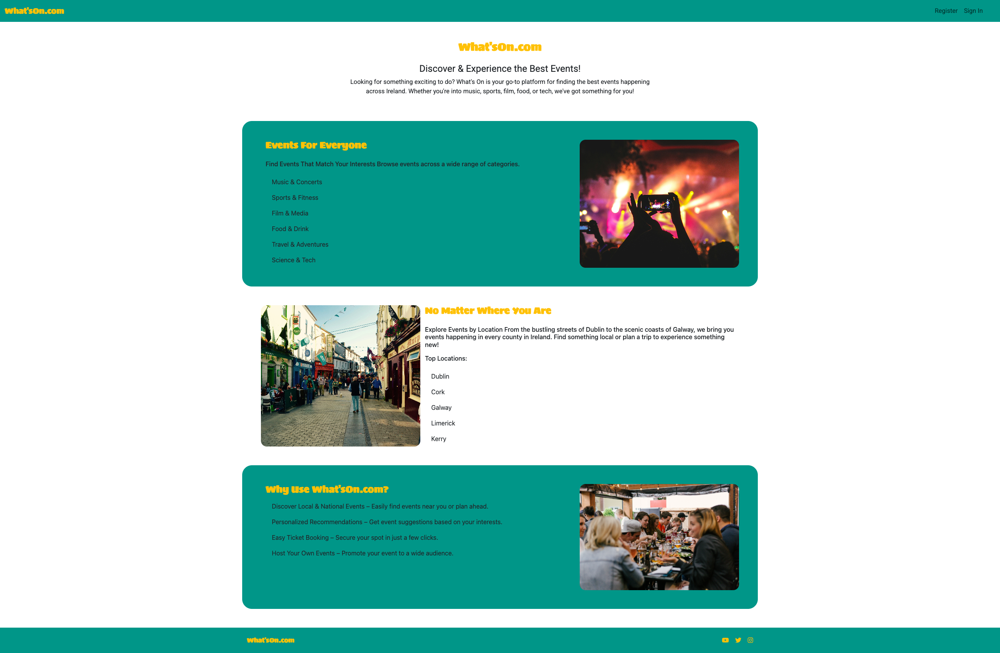

# What'sOn.com

Live Site: [What'sOn.com](https://whats-on-2ddb76c9efe6.herokuapp.com/)
Repository: [GitHub Repository](https://github.com/MarkClinton/whats-on)

## About
[What'sOn.com](https://whats-on-2ddb76c9efe6.herokuapp.com/) is a social events app which lets users create their own events and search for events theyre interested in. Users can express interest by attending events which they can keep track of in their My Events section. They can also create events which can be maintained in the My Events section. 

## User Experience Design 

### User Stories
#### **Events**
[Events Epic](https://github.com/MarkClinton/whats-on/issues/41)

| Issue ID    | User Story |
|-------------|-------------|
|[#29](https://github.com/MarkClinton/whats-on/issues/29)| As a attendee I can remove my attending status to an event so that I am no longer attending |
|[#28](https://github.com/MarkClinton/whats-on/issues/28)| As a attendee of an event I can view the event page so that see whats going on |
|[#27](https://github.com/MarkClinton/whats-on/issues/27)| As a user I can attend an event so that I can book my spot at the event.|
|[#26](https://github.com/MarkClinton/whats-on/issues/26)| As a user I can view the details of an event so that I can decide whether or not to attend.|
|[#24](https://github.com/MarkClinton/whats-on/issues/24)| As a event host I can edit the details of an event so that the event details are kept up to date.|
|[#23](https://github.com/MarkClinton/whats-on/issues/23)| As a host of an event I can delete an event so that the event no longer exists.|
|[#22](https://github.com/MarkClinton/whats-on/issues/22)| As a host of an event I can view my hosted events so that I can check all details.|
|[#21](https://github.com/MarkClinton/whats-on/issues/21)| As a user I can create an event so that I can allow others to attend.|
|[#25](https://github.com/MarkClinton/whats-on/issues/25)| As a host of an event I can remove an attendeeso that they no longer can go to the event.|
|[#32](https://github.com/MarkClinton/whats-on/issues/32)| As a host of an event I can disable and enable comments on my event so that attendees can or cannot comment.|

#### **User**
[User Epic](https://github.com/MarkClinton/whats-on/issues/39)

| Issue ID    | User Story |
|-------------|-------------|
|[#18](https://github.com/MarkClinton/whats-on/issues/18)| As a Site Manager/Admin I can access the admin panel so that I have a full overview of the models and their content |
|[#2](https://github.com/MarkClinton/whats-on/issues/2)| As a new user of Whats On I can sign up with my email to create an account So that I can search for events and use the full benefits of the site |
|[#3](https://github.com/MarkClinton/whats-on/issues/3)| As an existing user I can use my email to sign in so that I can access my account.|
|[#19](https://github.com/MarkClinton/whats-on/issues/19)| As a user I can edit my user profile so that my information is updated.|

#### **Categories**
[Categories Epic](https://github.com/MarkClinton/whats-on/issues/43)

| Issue ID    | User Story |
|-------------|-------------|
|[#44](https://github.com/MarkClinton/whats-on/issues/44)| As a Host I can add or edit the category for my event so that the correct category to my event |

## Technologies used

- ### Languages:
    
    + [Python 3.10.4](https://www.python.org/downloads/release/python-3104/): the primary language used to develop the server-side of the website.
    + [JS](https://www.javascript.com/): language used to develop some interactive components of the website.
    + [HTML](https://developer.mozilla.org/en-US/docs/Web/HTML): the markup language used to create the website.
    + [CSS](https://developer.mozilla.org/en-US/docs/Web/css): the styling language used to style the website.

- ### Frameworks and libraries:

    + [Django](https://www.djangoproject.com/): python framework used to create all the logic.
    + [Bootstrap 5.3](https://getbootstrap.com/docs/5.3/getting-started/introduction/): CSS framework used to design the site with builtin JS. 

- ### Databases:

    + [PostgreSQL](https://www.postgresql.org/): the database used to store all the data.

- ### Other tools:

    + [Git](https://git-scm.com/): the version control system used to manage the code.
    + [Pip3](https://pypi.org/project/pip/): the package manager used to install the dependencies.
    + [Gunicorn](https://gunicorn.org/): the webserver used to run the website.
    + [Spycopg2](https://www.python.org/dev/peps/pep-0249/): the database driver used to connect to the database.
    + [Django-allauth](https://django-allauth.readthedocs.io/en/latest/): the authentication library used to create the user accounts.
    + [Django-crispy-forms](https://django-cryptography.readthedocs.io/en/latest/): was used to control the rendering behavior of Django forms.
    + [Heroku](https://www.heroku.com/): the cloud platform used to host the website.
    + [PostgreSQL from Code Institute](https://dbs.ci-dbs.net/): PostgreSQL database used to store all the dat provided by Code Institute.
    + [GitHub](https://github.com/): used to host the website's source code.
    + [VSCode](https://code.visualstudio.com/): the IDE used to develop the website.
    + [Chrome DevTools](https://developer.chrome.com/docs/devtools/open/): was used to debug the website.
    + [Font Awesome](https://fontawesome.com/): was used to create the icons used in the website.
    + [Miro](https://miro.com/app/dashboard/) was used to make a flowchart for the README file.
    + [Balsamiq](https://balsamiq.com/) was used to make a wireframe mockups of the site.
    + [W3C Validator](https://validator.w3.org/): was used to validate HTML5 code for the website.
    + [W3C CSS validator](https://jigsaw.w3.org/css-validator/): was used to validate CSS code for the website.
    + [JShint](https://jshint.com/): was used to validate JS code for the website.
    + [PEP8](https://pep8.org/): was used to validate Python code for the website.

## Features

## Design 

## Information Architecture

## Testing

## Deployment

## Credits

- ### Resources
    - [favicon](https://realfavicongenerator.net/)
    - [Cloudconvert](https://cloudconvert.com/jpg-to-webp)
    - [Unsplash for images](https://unsplash.com/s/photos/event)
    - [StackOverflow](https://stackoverflow.com/)
    - [I Think Therefore I Blog](https://learn.codeinstitute.net/courses/course-v1:CodeInstitute+FSD101_WTS+6/courseware/713441aba05441dfb3a7cf04f3268b3f/824fccecd0fe4e44871eeabcbf69d830/)

- ### Helpful Links
    - [Custom Model with extra fields](https://www.youtube.com/watch?v=Ae7nc1EGv-A)
    - [Django phone number field](https://www.geeksforgeeks.org/properly-store-and-validate-phone-numbers-in-django-models/)
    - [Django phone number field ](https://django-phonenumber-field.readthedocs.io/en/latest/reference.html#usage)
    - [AllAuth with Custom User Model](https://docs.allauth.org/en/dev/account/advanced.html)
    - [Help with login form](https://stackoverflow.com/questions/39183479/django-all-auth-form-errors-not-displaying)
    - [Static HTML at the root using TemplateView](https://stackoverflow.com/questions/30650254/is-it-possible-to-serve-a-static-html-page-at-the-root-of-a-django-project)
    - [Building Django forms with django-crispy-forms](https://www.youtube.com/watch?v=MZwKoi0wu2Q)
    - [Updating a user](https://stackoverflow.com/questions/68343672/edit-and-update-user-model-in-django)
    - [Pagination](https://docs.djangoproject.com/en/5.1/topics/pagination/)
    - [Select Related](https://docs.djangoproject.com/en/5.1/ref/models/querysets/#select-related)
    - [Generic View and forms](https://stackoverflow.com/questions/45659986/django-implementing-a-form-within-a-generic-detailview)
    - [Upload images to cloudinary](https://cloudinary.com/documentation/python_sample_projects)
    - [Django 'No file chosen' in FileInput](https://stackoverflow.com/questions/63960326/django-no-file-chosen-in-fileinput)
    - [date__gte](https://stackoverflow.com/questions/45947222/django-queryset-with-datetime-need-to-get-all-future-dated-entries)
    - [Tabbed Content](https://www.w3schools.com/bootstrap/tryit.asp?filename=trybs_tabs_dynamic&stacked=h) 
    - [Tabbed Content](https://stackoverflow.com/questions/78590859/bootstrap-5-content-between-tabs-not-showing-nor-changing)

- ### Acknowledgments 
    - Thanks to my mentor [Juliia](https://github.com/IuliiaKonovalova) for all the help along the way with this project. 
    - A special shoutout to my girlfriend Aoife who helped keep me sane during this project. 
    - Thanks to [CodeInstitute](https://codeinstitute.net/ie/) who created the web terminal to display this Python project.